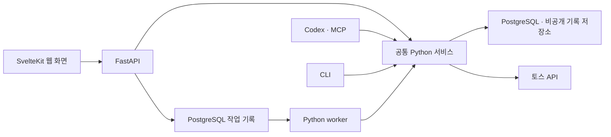

# 기술 스택 결정

결정일: 2026-09-10. 사용자가 승인한 목표 구성과 초기 도입 범위를 기록한다.
16번 PR에서 목표 구성을 문서화했고, 17번에서 저장 자료를 읽는 웹·API를 도입했다.
아래 표는 현재 도입 범위이며 영속 worker와 지속적인 AI 실행은 후속 작업이다.
현재 실행 방법과 완료 이력은 [README](../README.md)와 [인수인계](HANDOFF.md)를 따른다.

## 제품과 선택 기준

사용자는 웹 개발자이며, 브라우저에서 직접 설계한 투자 작업 공간을 원한다.
초기 대상은 로컬에서 사용하는 웹앱이고 모바일 앱은 범위에 포함하지 않는다.
Streamlit을 후속 제품 화면의 기반으로 사용하지 않는다.

이 프로젝트의 AI는 사용자가 대화하는 Codex다. AI가 계좌와 자료를 조사하고 분석 방법을
선택하며, 근거·대안·판단·재검토 기록을 남긴다. 특정 시가총액·가격 방향·투자 스타일에
판단을 고정하지 않는다. 모델이 바뀌어도 자료의 출처와 판단 이력을 인계한다.

기술은 실제 화면의 응답성, 기존 계산·검증 코드 재사용, 운영 복잡도와 검증 가능성을
함께 고려해 선택했다. 공개 DOM 벤치마크의 차이를 트레이딩 앱 전체의 성능 차이로
해석하지 않는다. 새 구성의 성능은 아직 이 프로젝트에서 측정하지 않았다.

## 채택 구성과 구현 상태

| 영역 | 채택 구성 | 현재 상태와 역할 |
| --- | --- | --- |
| 웹 화면 | Svelte 5 + SvelteKit + TypeScript | 도입. 저장된 계좌·연구 목록과 연결 기록 상세를 읽는 정적 웹앱이다. |
| UI 기반 | Tailwind CSS + shadcn-svelte | 도입. 공통 버튼·입력과 작업실의 표·목록·읽기 패널을 구성한다. |
| 웹 API | FastAPI | 도입. 공통 Python 조회 서비스와 입력·응답·오류 계약을 연결한다. |
| 투자·분석 로직 | 기존 Python 서비스 | 유지. API·CLI·MCP가 같은 계산과 검증을 사용한다. |
| DB | PostgreSQL | 기존 구성 유지. 현재 Compose 이미지는 PostgreSQL 18.6이다. |
| DB 접근·변경 | SQLAlchemy + psycopg + Alembic | 이미 사용 중. Python 데이터 접근과 스키마 마이그레이션을 계속 담당한다. |
| API 계약 공유 | OpenAPI 기반 TypeScript 클라이언트 생성 | 도입. Hey API로 생성하며 스키마·클라이언트 재생성의 일치를 검사한다. |
| 서버 데이터 상태 | TanStack Query의 Svelte 어댑터 | 도입. 계좌 선택별 조회·로딩·오류·파일 재조회를 관리한다. |
| 금융 차트 | TradingView Lightweight Charts | 도입 예정. 캔들·거래량·가격 시계열을 렌더링하며 시장 데이터는 프로젝트가 공급한다. |
| 긴 작업 | 별도 Python worker + PostgreSQL 작업 기록 | 도입 예정. 수집·분석·백테스트의 실행 상태와 재시작 복구를 관리한다. |
| AI 연결 | 프로젝트 MCP + 기존 CLI | 이미 구현. 별도 모델 API 서비스 도입은 이번 구성에 포함하지 않는다. |
| 검증 | pytest·Ruff 유지, Vitest·Playwright 추가 | Python 검증을 유지하고 프론트 로직·실제 브라우저 흐름을 검사한다. |
| 관측 | 구조화 로그 + pg_stat_statements | 도입 예정. 요청·외부 API·작업·SQL의 소요 시간과 오류를 추적한다. |
| 개발·로컬 운영 | mise + uv + Docker Compose | 기존 구성 유지. 웹 빌드용 Node 24.18.0·pnpm 11.13.0을 프로젝트 범위에서 고정한다. |

신규 패키지의 세부 버전은 구현 시 상호 호환성을 확인하고 잠금 파일로 고정한다.
개발 기기에 도구가 설치돼 있다는 사실을 프로젝트 도입 완료로 기록하지 않는다.
Python 의존성은 `uv.lock`, 프론트 의존성은 `web/pnpm-lock.yaml`로 관리한다.
현재 설치·실행·검증 절차는 [웹 작업실 안내](WEB_WORKBENCH.md)를 따른다.

## SvelteKit과 FastAPI의 역할

Svelte 5는 UI 컴포넌트와 반응형 갱신을 담당하고, SvelteKit은 그 컴포넌트를 사용하는
웹앱의 라우팅·레이아웃·데이터 로딩·빌드 구성을 담당한다. SvelteKit은 내부적으로 Vite를
사용한다. React/Next.js와 SolidJS/SolidStart를 비교한 뒤 이 구성을 선택했다.
Svelte의 HTML·CSS 중심 개발 경험과 앱 구성의 일관성을 선택 이유로 삼는다.

FastAPI는 이미 있는 Python 투자 로직을 직접 재사용할 수 있다는 이점이 크다.
NestJS·Go도 API 서버로 사용할 수 있지만, 기존 Python 기능을 유지하면 프로세스 간
호출이나 별도 작업 실행 계약을 추가해야 한다. 현재는 공통 Python 서비스와 테스트를
공유하는 구성을 채택한다. FastAPI가 모든 작업에서 가장 빠르다는 의미는 아니다.

전체 목표 호출 구조는 다음과 같다. 17번의 웹·API는 비공개 저장 자료를 읽는 경로까지
연결했으며, 그림의 Jobs·Worker와 HTTP를 통한 토스 수집은 후속 구현 범위다.

API 라우트에는 웹 계약을 두고, 계좌 의미·자료 시점·금융 계산·판단 검증은 공통 서비스에
둔다. 긴 작업을 제공하는 CLI·MCP 진입점도 작업 기록과 중복 방지 정책을 공유하도록 연결한다.
이 통합은 후속 구현 대상이며 현재 MCP 호출에 영속 작업 큐가 있다는 뜻은 아니다.

## 초기 실행·배포 방식

초기는 SvelteKit을 브라우저 중심 웹앱으로 구성하고 정적 파일로 빌드한다.
FastAPI 쪽에서 정적 파일과 API를 함께 제공하는 같은 출처 구성을 기본으로 삼는다.
개발 중에는 프론트 개발 서버와 Python API를 실행하고 개발용 프록시로 연결할 수 있다.
Node는 프론트 개발·빌드에 필요하지만 초기 운영에 별도 Node 서버를 상시 실행하지 않는다.

SvelteKit의 요청 시점 SSR이나 서버 전용 라우트를 사용하려면 JavaScript 서버 실행 환경이
필요하다. 초기 정적 배포에는 이 기능을 사용하지 않는다. 계좌 데이터는 브라우저에서
API로 조회하고, 토스 자격증명은 기존 Python 자격증명 해석기를 통해 서버 측에서만 사용한다.
정적 파일에 계좌·비밀값을 빌드해 넣지 않는다.

초기 실행 대상은 현재 Mac의 로컬 환경이다. 정적 배포는 데이터가 갱신되지 않는다는 뜻이
아니며, 원격 배포나 상시 운영이 필요해지면 접근 제어·HTTPS·초기 로딩 지연을 포함해
배포 방식을 다시 설계한다. 모바일 앱과 회사 서버 배포는 이번 범위에 포함하지 않는다.

## 데이터와 계산 계약

- 금액·가격·소수점 수량은 기존 Python `Decimal`과 PostgreSQL `NUMERIC` 정책을 유지한다.
  API에서도 정확한 소수 표현을 보존한다. 차트 표시를 위한 숫자 변환을 원장 계산에 사용하지 않는다.
- 거래·관측 시각, 자료 공개/이용 가능 시각, 수집 시각, 기록 시각의 의미를 구분한다.
  원본의 시간대 정보와 UTC 기준을 보존하고 화면 표시 시각을 별도로 변환한다.
- 종목·계좌 관측·자료·판단·작업의 식별자와 출처 참조를 유지한다. 계좌 통화는 명시하고,
  현금·매수 가능 금액·미확인 값을 구분한다.
  HTTP의 계좌 순번은 십진 문자열로 보내 브라우저의 큰 정수 반올림을 방지한다.
- 현재 계좌·AI 판단 원본은 비공개 JSON 객체로 보존한다. 모두 PostgreSQL로 이전된
  상태가 아니다. 향후 DB 조회 색인을 추가할 때 원본과 해시를 보존하고 참조를 연결한다.
- 화면 캐시는 관측의 최신성을 보장하지 않는다. 원본 관측 시각과 마지막 조회 결과를
  표시하고 갱신 실패를 이전 자료의 성공으로 덮어쓰지 않는다.
- 재시도 가능한 작업과 동일 요청 식별 기준을 정의한다. 완료 결과의 동일성 검사와
  실행 중 작업의 중복 방지를 별도로 구현한다.

현재 자료·계좌·판단 계약의 상세는 [데이터 계약](DATA_CONTRACT.md),
[계좌 조회](TOSS_ACCOUNT.md), [AI 작업 공간](AI_WORKSPACE.md)을 따른다.

### 시간 단위와 전략 범위

자료를 관측하는 주기, AI가 다시 판단하는 시점, 포지션을 보유하는 기간은 독립적으로
설계한다. 시장·종목·새 근거에 따라 판단 빈도와 보유기간을 바꿀 수 있어야 한다.
한 계좌에서 당일 매매와 수주 보유가 공존할 수 있으며 장기 보유 중에도 사건에 즉시
재판단할 수 있어야 한다. 이는 후속 AI 운용 요구이며 현재 자동 감시가 구현됐다는 뜻은 아니다.

현재 정규화된 연구 자료는 확정 일봉이며 종목·거래일당 하나를 허용한다. DB의
`daily_bars` 기본키도 자료 묶음·종목·거래일로 구성된다. 기존 비교 규칙은 12-1개월
모멘텀과 월말 중심 재검토를 사용하고, 백테스트는 다음 거래일 종가 체결을 가정한다.
이는 현재 구현한 분석 도구의 범위이며 AI의 투자 판단을 이 전략에 고정하지 않는다.

프로젝트의 토스 원응답 수집 계약은 `1m`·`1d` 조회를 허용하지만, 원응답 저장과
연구 자료 정규화·백테스트 입력 연결은 별개다. 분봉·틱을 보조 조사 자료로 추가하는
것은 기능 확장이다. 장중 신호·매매 판단까지 도입한다면 봉 주기·시작/종료 시각·
이용 가능 시점·고유키와 체결·비용 가정을 함께 설계하고 기존 일봉 전략과 별도로 검증한다.
주봉도 표시용 집계와 전략 입력 교체를 구분하며 관측 개수 기반 조건의 의미를 확인한다.

TimescaleDB 도입 여부는 저장·조회 요구에 따른 선택이다. 설치만으로 자료 계약이
확장되거나 전략이 바뀌지 않으며 분봉 사용 자체가 TimescaleDB의 필수 도입 조건은 아니다.

## 작업 실행과 성능 측정

긴 작업은 요청 처리와 실행을 분리하고 작업 ID로 상태·결과를 조회한다.
PostgreSQL에 대기·실행·완료·실패 상태, 취소 요청, 시도 이력과 실행 소유권을 기록하는
구조를 구현한다. worker 재시작 후 복구, 외부 요청 제한, 중복 실행과 결과 저장을 함께 검증한다.
구체적인 실행기·조회 주기·잠금 정책은 해당 기능의 구현에서 확정한다.

토스 조회 등 기존 동기 I/O와 긴 CPU 계산이 API의 다른 요청을 막지 않도록 실행 경계를
설계한다. `async` 선언이나 프레임워크 교체만으로 기존 계산이 빨라진다고 가정하지 않는다.
현재 작업 실행은 주로 동기 CLI와 프로세스 내 잠금이며 위 영속 worker 구조는 아직 없다.

최적화는 다음 관측을 바탕으로 진행한다.

- 화면: 데이터 도착부터 표시까지 지연, 표 스크롤·선택 반응, 차트 부분 갱신,
  종목 전환·장시간 실행 시 메모리 추이.
- API·worker: 요청·작업 ID, 처리 시간, 외부 호출 대기, 오류와 재시도 횟수.
- DB: 실제 조회 SQL의 실행 계획과 통계, 읽은 행·버퍼, 인덱스·집계의 효과.

조회 패턴에 맞춰 복합 인덱스·페이지 조회·필요한 집계를 먼저 설계한다.
큰 표의 가상 스크롤이나 시계열 파티셔닝은 실제 화면·데이터 규모를 확인해 구현한다.
[기존 성능 측정](PERFORMANCE.md)은 합성 자료의 한정된 조회 실험이며 새 웹앱의 성능 증거가 아니다.

## 초기 구성에서 제외한 기술

다음 세 기술은 초기 의존성·DB 확장·Compose 서비스에 넣지 않는다.
초기 작업 관리는 PostgreSQL 기록과 Python worker로 구현한다.

| 기술 | 제외 이유 | 이후 해당 기능을 개발한다면 확인할 것 |
| --- | --- | --- |
| TimescaleDB | 현재 일봉 중심 저장 구조에서 대규모 틱 수집·압축·연속 집계 요구가 확정되지 않았다. | 분봉·틱을 대규모로 쌓기 전에 시간 분할 기준, 기본키·외래키, 보관·집계 정책과 이관 비용을 결정한다. |
| pgvector | 의미 검색과 임베딩 생성이 초기 구현 기능으로 확정되지 않았다. | 원문 식별자, 문서 분할·임베딩 모델·차원·버전과 검색 품질 평가를 먼저 정하고 벡터 저장을 추가한다. |
| Redis | 공유 캐시가 필요한 실행 규모나 측정된 반복 조회 병목이 아직 없다. | 원본 저장소, 캐시 만료·무효화, 오래된 자료 표시와 장애 시 동작을 정의한다. |

미래 기술을 사용하기 위한 빈 설정이나 미사용 연결 계층을 먼저 추가하지 않는다.
요구가 달라져 재도입을 결정하면 데이터 이관·검증·복구를 포함한 별도 변경으로 다룬다.
특히 TimescaleDB로 기존 테이블을 전환할 때는 데이터 이동·잠금·키 제약을 검토해야 하며,
나중에 비용 없이 전환할 수 있다고 가정하지 않는다.

## 운영과 검증

기존 프로젝트 전용 DB·mise·uv·Compose 구성을 유지한다. 프론트 도구도 전역 설정을
바꾸지 않고 프로젝트 버전과 잠금 파일로 관리한다. 신규 라이브러리의 Svelte 5 호환성,
정적 배포 조건과 라이선스를 구현 시 확인한다. Lightweight Charts는 공식 출처 표시
요건을 적용한다.

Python 기능에는 기존 pytest·Ruff를 사용하고, 신규 화면에는 타입 검사·프로덕션 빌드와
Vitest·Playwright 검증을 연결한다. API 계약 생성 결과도 함께 검사한다. 테스트는 데이터
계약·오류·갱신·작업 복구와 주요 사용자 흐름을 확인하도록 구성한다.

DB와 비공개 원본 파일의 백업 범위를 함께 관리한다. 현재 로컬 백업·복원 검증은 있으나
사본이 같은 장치에 있고 정기 외부 백업은 아직 없다. 별도 장치/저장소에 암호화한 사본을
두는 방식은 목적지·자격증명·보관 기간을 정한 후 후속 작업으로 구현한다.
절차는 [DB 백업](LOCAL_BACKUP.md)과 [개인 자료 백업](ARTIFACT_BACKUP.md)을 따른다.

## 후속 구현 순서

17번은 SvelteKit·FastAPI 연결, 공통 조회 서비스 재사용, 저장 계좌·판단·근거 표시와
API 타입 공유를 구현한다. 후속 기능의 제안 순서는 다음과 같다.

1. 18번: PostgreSQL 영속 작업 기록과 Python worker. 중복 방지·취소·재시작 복구.
2. 19번: 다양한 시간 단위의 시장 관측과 사건·종목·근거 연결, 검증한 자료의 차트 표시.
3. 20번: 기회 탐색과 상황에 따라 조절되는 AI 조사·재판단. Codex 실행·문맥 인계 경계.
4. 21번: 자금 운용 제안과 계산. 추가매수·축소·교체 등의 대안 및 자금·노출 비교.
5. 22번: 판단을 먼저 기록하고 이후 관측으로 모의체결·성과·재검토를 잇는 전향적 평가.

각 기능의 실제 지연·메모리·SQL을 측정해 필요한 최적화를 수행한다. 이후 실제 주문을
연결하려면 주문·부분체결·취소·증권사 기록 대사와 미확인 계좌 범위를 별도로 다룬다.

후속 구현은 이 결정 문서를 기준으로 새 기능 브랜치에서 진행하며,
브랜치와 PR 처리 원칙은 [작업 지침](../AGENTS.md)을 따른다.

## 근거 문서

- [SvelteKit의 역할](https://svelte.dev/docs/kit/introduction),
  [정적 SPA 구성과 초기 로딩의 제약](https://svelte.dev/docs/kit/single-page-apps)
- [FastAPI 기능](https://fastapi.tiangolo.com/features/),
  [TypeScript 클라이언트 생성](https://fastapi.tiangolo.com/advanced/generate-clients/),
  [동기·비동기 실행](https://fastapi.tiangolo.com/async/)
- [shadcn-svelte](https://www.shadcn-svelte.com/docs),
  [TanStack Svelte Query](https://tanstack.com/query/latest/docs/framework/svelte/reference/index),
  [Lightweight Charts와 출처 표시](https://tradingview.github.io/lightweight-charts/docs)
- [PostgreSQL 정밀 숫자](https://www.postgresql.org/docs/current/datatype-numeric.html),
  [SQL 실행 통계](https://www.postgresql.org/docs/current/pgstatstatements.html)
- [TimescaleDB 변환 제약](https://github.com/timescale/docs/blob/latest/api/hypertable/create_hypertable.md),
  [pgvector](https://github.com/pgvector/pgvector),
  [Redis 캐시 만료·무효화](https://redis.io/docs/latest/develop/use-cases/cache-aside/)
